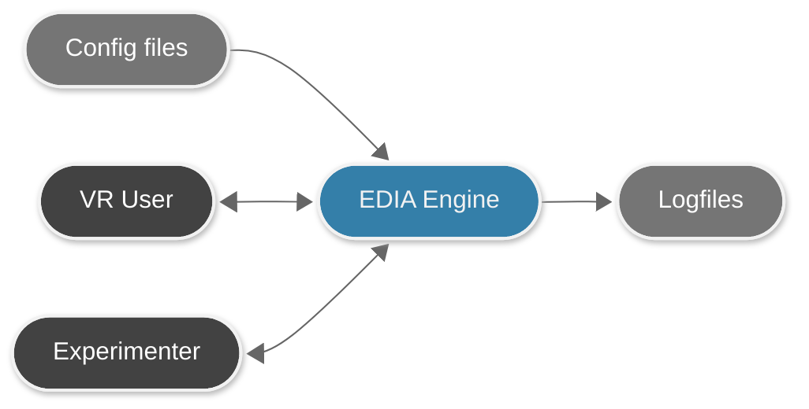

<p align="center">
  
</p>
  
# EDIA – A Unity XR Toolbox for Research

 `EDIA` provides you with a set of modules (Unity packages) to facilitate the design and conduction of experimental research in XR using Unity.  

## `EDIA` Features:
🧱 Structure your experiment on multiple levels.    
🗂️ Manage it using Config Files.  
👁️ Unified eye tracking integration.  
🛜 Remotely control mobile XR experiments.     
✏️ Automatically log relevant data.  
🟰 Synchronize with external data.  

## `EDIA` in a nutshell


# `EDIA` is for you if ....
- you want to build experiments which use different tasks in the same experimental session.
- you need high temporal precision to, for example, synchronize your experiment with EEG.
- you want an easy integration of eye tracking in your experiment.
- you want to use configuration files (JSON) to manage your experiment.

# Getting started
For newcomers to EDIA, we recommend to follow our "[Getting started](https://mind-body-emotion.notion.site/EDIA-Tutorial-1cb03dd4773f801285edf12e8b6018bd)" guide. This also has more detailed instructions on how to install `EDIA` as a package and how to set up your Unity Editor. 

# Installation

### As a package (Unity package manager)
- In Unity open the package manager window → **Window** → **Package Manager**  
- Use `Install from GIT URL`  
- To install:
  - **Latest release**:  
    `https://github.com/edia-toolbox/edia_core.git?path=Assets/com.edia.core#main`
  - **Specific release** (replace `vX.Y.Z` with a version from the [release list](https://github.com/edia-toolbox/edia_core/releases)):  
    `https://github.com/edia-toolbox/edia_core.git#vX.Y.Z`
  - **Development version**:  
    `https://github.com/edia-toolbox/edia_core.git?path=Assets/com.edia.core`
- Hit `ADD`

Unity now starts to download and install the `com.edia.core` package. 

### For development
Clone this repository. 

## Resources
📖 [EDIA Manual](https://mind-body-emotion.notion.site/EDIA-Toolbox-710f144129a245debd9b71948084ea95?pvs=4)  
🐣 [Getting started guide](https://mind-body-emotion.notion.site/EDIA-Tutorial-1cb03dd4773f801285edf12e8b6018bd)  
⌨️ [HTML API Reference](https://gitlab.gwdg.de/edia/edia_core/-/tree/fix/%2328/doxyGenUpdate/Assets/com.edia.core/Documentation~/index.html)  
📝 [GitHub Discussion board](https://github.com/edia-toolbox/edia_core/discussions)  

## ThirdParty
The following assets and packages are incorporated in edia.core:
- [UXF — Unity Experiment Framework](https://github.com/immersivecognition/unity-experiment-framework/) (Brookes et al., [2020](https://link.springer.com/article/10.3758/s13428-019-01242-0))  ➡️ Core asset where `EDIA` is heavily inspired by and based upon.
- [SimpleFileBrowser](https://github.com/yasirkula/UnitySimpleFileBrowser) ➡️ Enabling selecting custom logfile storeage location.
- [RoundedUICorners](https://github.com/kirevdokimov/Unity-UI-Rounded-Corners) ➡️ Enhancement of UI items.
- `Test Chamber` asset from the [OpenEnvironments repository](https://gitlab.com/eventlabprojects/openenvironments/-/tree/main) ➡️ A simple, clean VR environment for our sample scene.

## About 
The `EDIA` toolbox was and is developed in the context of the [Mind-Body-Emotion
group](https://mind-body-emotion.de/) (lead by [Michael Gaebler](https://michagaebler.github.io//)) at the [Max Planck Institute for Human Cognitive and Brain Sciences](https://www.cbs.mpg.de/en). 


## Contribution
We are happy to receive feedback and contributions. If you want to report a bug, please open a GitHub issue. 
If you have questions or suggestions, please use the [GitHub Discussion board](https://github.com/edia-toolbox/edia_core/discussions). 
If you want to [contribute](./CONTRIBUTOR.md) code, ideally first reach out to us (e.g., via the [Discussion board](https://github.com/edia-toolbox/edia_core/discussions) or [email](mailto:edia.toolbox@gmail.com)), and/or post a pull request.  

## Citation
If you are using the `EDIA` toolbox or any of its constituents, please cite this repository as _Software_:
```
Klotzsche, F., & de Mooij, J. EDIA — A Unity XR Toolbox for Research [Computer software]. https://github.com/edia-toolbox/edia_core
```
